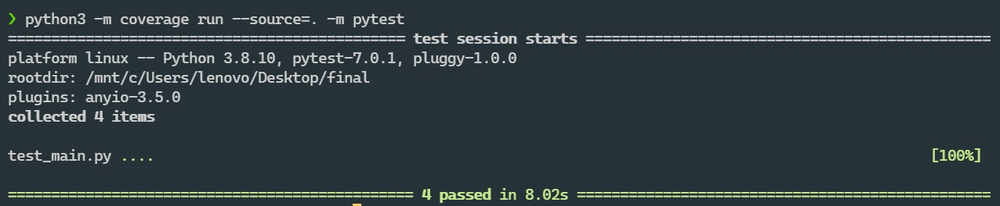
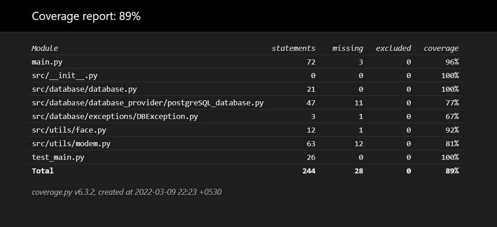
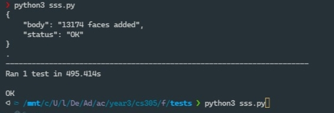

> # CS305 Assignment 2
> Submitter name: Aneeket Mangal\
> Roll No.: 2019CSB1071\
> Course:  CS305 Software Engineering


## 1. What does this program do
This program is a python based web server, that provides functionality for:
* Adding images to a database on the server, either individually or in bulk (through a zip file).
* Fetching the metadata of the images in the database.
* Searching for top-k matches of an image in the database.
* Fetching info/metadata of an image in the database.

## 2. A description of how this program works
Following web API endpoints are implemented in the program:

**Note:** All the endpoints accept POST requests only.

> * Face information stored in the database is a BLOB object, which is a python pickle object (pickle of 1X128 ```numpy``` array face encoding given by ```face_recognition``` libarary).
>
>  * pickle is a BLOB object. It is a way to store and transmit data structures in python. Most of the database provides provide a data type to insert BLOB objects. Hence it would be beneficial to store blob, if one wants to change the database service (which is a abstract layer) in the future.
> * Following metaData information is inserted in the database:
>     * Person name (name of the file is taken to be the name of the person)
>     * Location (if its present in EXIF data of the image)
>     * Date of insertion
>     * Version (if its present in the EXIF data of the image).

Following processing happens when the different endpoints are called.
* ## /add_face/
  * This end point is used to add a face to the database on the server.
  * The form data should contain a single image file.

  * After recieving the image, the server extracts the face encoding from the image(in case a face exists) and adds it to the database.

* ## /add_faces_in_bulk/
  * This end point is used to add multiple faces to the database on the server.

  * The request body should contain a zip(tar is not allowed) file containing multiple images.

  * After recieving the zip file, the server extracts the face encodings from the images(in case a face exists) and adds them to the database.

* ## /get_face_info/
  * This api endpoint provides metadata of the image with a given id, provided in form data.

* ## /search_faces/
  * This api endpoint provides a fast and efficient retrieval of top-k matches in the database.
  * Top k matches are provided for each face in the image
  * The values k and tolerance are passed as URL parameters.
  * It compares the input image with all faces in the database and find top k matching images (their id and name).
  An API for efficient and fast retrieval of top-k matches in the database, when an unknown photo is supplied.


## 3. How to compile and run this program
### Prerequisites:
* Python 3.8 or above
* pip version 20.0.2 or above
* This program was developed using Python 3.8.10 on Ubuntu 20.04.3 LTS on WSL2.
* The database service implemented is PostgreSQL. Install the package from apt repository.
* The API is based on FastAPI. 
* Configure the database accordingly. And provide the database configurations in the [config.json](config.json) file.
* Make sure the database in the config.json file is already created.

* Install face_recognition library and required dependencies(dlib with python binding) using instructions from this [github link](https://github.com/ageitgey/face_recognition/blob/master/README.md)

* Install the other required python packages using the following command:
  ```
    pip3 install -r requirements.txt
  ```

* Start the postgres server
  ```
    sudo service postgresql start 
  ```

* Logging is done to provide info of the program execution.
* Logs are by default present in the logs directory, in logs.log file
### Instruction to run the program
* Locate to the root directory of the program.
* Configure the [config.json](config.json) file. 
* To start the web server, run the following command
  ```
    python3 main.py
  ```
* You can now test api using thunderclient/postman.


### Instruction to run the tests
* Locate to the root directory of the program.
* Configure the [config.json](config.json) file. 
* Make sure that the relation mentioned in the config file has never been edited before or it simply does not exist. (Program creates a table if its not present)
* Run the following command to run the tests:
  ```
    python3 -m coverage run --source=. -m pytest 
  ```
* To generate the report:
  > **Generating HTML Report:**
  > ```
  > python3 -m coverage html
  > ```
  >
  > **Generating Terminal Report:**
  > ```
  > python3 -m coverage report
  > ```
  >
  > HTML report is present [here](htmlcov/index.html).


## Results of testing on the LFW dataset
  > Inserting the entire dataset took 495.414 seconds.
  >
  > Screenshot of the same is attached below.
  >
  > On average ```/search_faces``` took 3-5 seconds.


## 4. Provide a snapshot of a sample run
* The coverage of tests is 89% as tested using Coverage.py.





* Screenshot of test on LFW dataset



